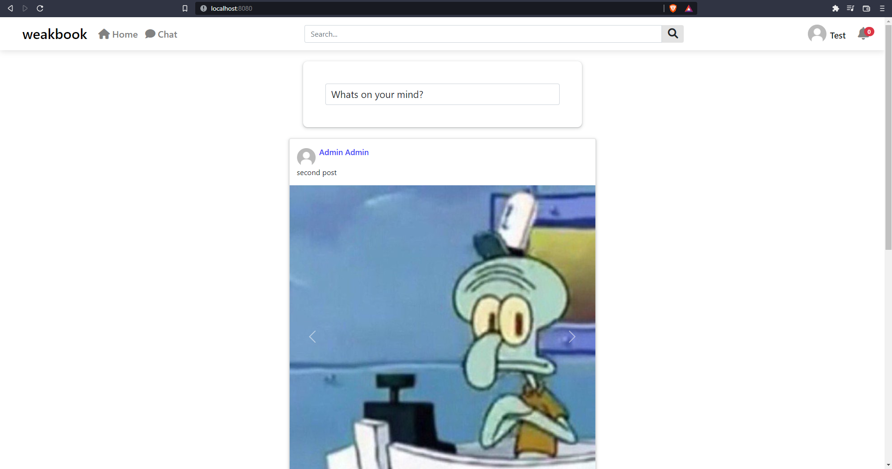

# weakboook

___

weakbook is a social media built with Spring Boot, MySQL and JavaScript.

## Features

___

* Creating an account
* Login and Logout
* Chatting and receiving messages from friends
* Receiving notifications in real time from friend requests, liking and commenting a post
* Creating posts
* Liking posts
* Commenting posts
* Sending and accepting friend requests
* Removing friends from the friends list
* View own profile
* View other users profiles

## Technologies used

___

### Stack:

* Java 11
* Spring: Spring Boot, MVC, Data JPA, Security
* Maven
* MySQL
* Thymeleaf
* Javascript, jQuery
* HTML, CSS, Bootstrap

## Quick start

---

### Required:

* Java 11
* Maven

### User Credentials:

* email: user1@weakbook.com
* password: 123456789Aa

## Screenshots

___

